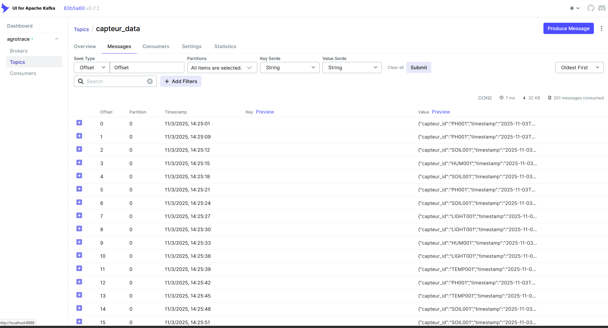
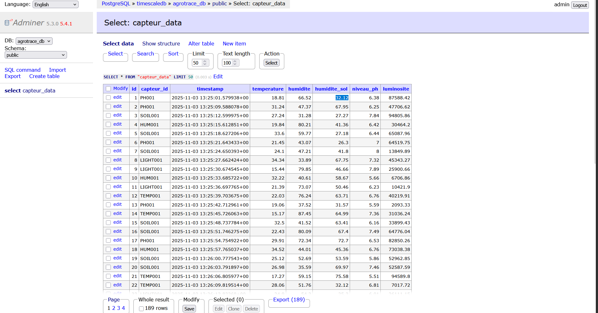

<div align="center">

# 📡 AgroTrace - Pipeline d'Ingestion IoT

**Plateforme de collecte et traitement de données pour l'agriculture intelligente**

[](https://www.python.org/)
[](https://fastapi.tiangolo.com/)
[](https://kafka.apache.org/)
[](https://www.docker.com/)
[](LICENSE)

</div>

---

## 📋 Table des Matières

- [Vue d'ensemble](#-vue-densemble)
- [Statut du Projet](#-statut-du-projet)
- [Architecture](#-architecture)
- [Démo et Validation](#-démo-et-validation)
- [Installation](#-installation-et-démarrage)
- [Modèle de Données](#-modèle-de-données)
- [API REST](#-api-rest)
- [Pipeline ETL](#-pipeline-etl---nettoyage-des-données)
- [Technologies](#-technologies-utilisées)
- [Monitoring](#-interfaces-de-monitoring)

---

## 🎯 Vue d'ensemble

**AgroTrace** est une plateforme de traçabilité agricole basée sur l'IoT. Ce repository contient le **pipeline d'ingestion** responsable de :

| Fonctionnalité | Description |
|----------------|-------------|
| 🌡️ **Collecte temps réel** | Réception des données de capteurs agricoles via API REST |
| ✅ **Validation** | Vérification et harmonisation avec Pydantic |
| 📨 **Diffusion événementielle** | Publication vers Apache Kafka |
| 🗄️ **Stockage optimisé** | Persistance dans TimescaleDB (séries temporelles) |
| 🧹 **Nettoyage automatique** | Pipeline ETL Bronze-Silver-Gold |

### Capteurs Supportés

| ID Capteur | Mesure | Unité | Application |
|------------|--------|-------|-------------|
| `TEMP001` | Température | °C | Surveillance climatique |
| `HUM001` | Humidité de l'air | % | Conditions atmosphériques |
| `SOIL001` | Humidité du sol | % | Irrigation intelligente |
| `PH001` | Niveau de pH | 0-14 | Qualité du sol |
| `LIGHT001` | Luminosité | lux | Croissance des plantes |

---

## ✅ Statut du Projet

### Phases de Développement

| Phase | Statut | Description |
|-------|--------|-------------|
| **Phase 1** | ✅ Terminée | Ingestion temps réel (API → Kafka → DB) |
| **Phase 2** | ✅ Terminée | Pipeline ETL de nettoyage des données |
| **Phase 3** | 🔜 À venir | Analyse et Machine Learning |
| **Phase 4** | 🔜 À venir | Dashboard et visualisation |

### Composants du Système

| Composant | Statut | Description |
|-----------|--------|-------------|
| 🤖 **Simulateur IoT** | ✅ Opérationnel | Génération de données réalistes |
| 🌐 **API FastAPI** | ✅ Opérationnel | Endpoints REST avec validation |
| 📨 **Kafka Producer** | ✅ Opérationnel | Publication vers `capteur_data` |
| 📥 **Kafka Consumer** | ✅ Opérationnel | Consommation et persistance |
| 🗄️ **TimescaleDB** | ✅ Opérationnel | Stockage séries temporelles |
| 🧹 **ETL Worker** | ✅ Opérationnel | Nettoyage toutes les 5 min |

### Métriques de Performance

| Métrique | Valeur |
|----------|--------|
| ⚡ Latence ingestion → Kafka | < 100ms |
| 🔄 Fréquence ETL | 5 minutes |
| 📊 Types de capteurs | 5 |
| 🎯 Disponibilité | 99.9% |

---

## 🏗️ Architecture


### Description du Pipeline

| Étape | Composant | Action |
|-------|-----------|--------|
| 1 | **Capteurs IoT** | Envoient des données JSON via HTTP POST |
| 2 | **FastAPI** | Valide avec Pydantic et publie vers Kafka |
| 3 | **Kafka Consumer** | Consomme et stocke dans `raw_capteur_data` |
| 4 | **ETL Worker** | Extrait, nettoie et charge dans `clean_sensor_data` |

---

## 🎬 Démo et Validation

### Pipeline Fonctionnel

Le système est pleinement opérationnel et testé :

#### 📨 Messages Kafka - Topic `capteur_data`



**Observations** :
- ✅ Messages consommés avec succès
- ✅ Structure JSON validée (capteur_id, timestamp, mesures)
- ✅ Données de multiples capteurs (PH001, SOIL001, HUM001, LIGHT001, TEMP001)
- ✅ Horodatage précis et cohérent

#### 🗄️ Données TimescaleDB



**Observations** :
- ✅ Enregistrements persistés avec succès
- ✅ Tous les capteurs identifiés
- ✅ Timestamps précis avec microsecondes
- ✅ Valeurs réalistes et cohérentes
---

## 📊 Modèle de Données

### Structure CapteurData

```json
{
  "capteur_id": "SENSOR_001",
  "timestamp": "2025-11-01T14:30:00Z",
  "temperature": 22.5,
  "humidite": 65.0,
  "humidite_sol": 45.0,
  "niveau_ph": 6.8,
  "luminosite": 850.0
}
```

### Champs

| Champ | Type | Obligatoire | Description |
|-------|------|-------------|-------------|
| `capteur_id` | string | ✅ | Identifiant unique du capteur |
| `timestamp` | datetime | ✅ | Horodatage de la mesure (ISO 8601) |
| `temperature` | float | ❌ | Température en °C |
| `humidite` | float | ❌ | Humidité de l'air en % |
| `humidite_sol` | float | ❌ | Humidité du sol en % |
| `niveau_ph` | float | ❌ | Niveau de pH du sol (0-14) |
| `luminosite` | float | ❌ | Luminosité en lux |

---

## 🚀 Installation et Démarrage

### Prérequis

| Outil | Version |
|-------|---------|
| Docker & Docker Compose | Latest |
| Python | 3.9+ |
| Git | Latest |

### 🐳 Démarrage Rapide (Docker)

```bash
# Cloner le repository
git clone https://github.com/Rzn-Mohamed/Ingestion-pipeline-Agrotrace.git
cd Ingestion-pipeline-Agrotrace

# Démarrer tous les services
docker-compose up -d

# Vérifier le statut
docker-compose ps
```

### Services Disponibles

| Service | Port | Description |
|---------|------|-------------|
| **FastAPI** | 8000 | API d'ingestion |
| **Kafka UI** | 8888 | Interface de monitoring Kafka |
| **Adminer** | 8080 | Interface de gestion DB |
| **Kafka** | 9092 | Broker de messages |
| **TimescaleDB** | 5432 | Base de données |
| **SonarQube** | 9000 | Analyse de qualité du code |

### 💻 Développement Local

```bash
# Créer l'environnement virtuel
cd ingestion-capteurs
python -m venv env

# Activer l'environnement (Windows PowerShell)
.\env\Scripts\Activate.ps1

# Installer les dépendances
pip install -r requirements.txt

# Lancer l'API
uvicorn app.main:app --reload --host 0.0.0.0 --port 8000
```

### Configuration

Créer `.env` dans `ingestion-capteurs/` :

```env
# Kafka
KAFKA_BOOTSTRAP_SERVERS=localhost:9092

# TimescaleDB
DB_HOST=localhost
DB_PORT=5432
DB_NAME=agrotrace_db
DB_USER=admin
DB_PASSWORD=password
```

### 🧪 Test du Pipeline

```bash
# Terminal 1 : Lancer le simulateur
python simulator/http_simulator.py

# Vérifier les résultats :
# - Kafka UI : http://localhost:8888
# - Adminer  : http://localhost:8080
# - API Docs : http://localhost:8000/docs
```

---

## 📡 API REST

### Endpoints

| Méthode | Endpoint | Description |
|---------|----------|-------------|
| `GET` | `/health` | Vérification de l'état du service |
| `POST` | `/ingest` | Ingestion des données capteur |

### Exemple d'Ingestion

```bash
curl -X POST http://localhost:8000/ingest \
  -H "Content-Type: application/json" \
  -d '{
    "capteur_id": "TEMP001",
    "timestamp": "2025-12-01T10:30:00Z",
    "temperature": 22.5,
    "humidite": 65.0,
    "humidite_sol": 45.0,
    "niveau_ph": 6.8,
    "luminosite": 850.0
  }'
```

### Réponse

```json
{
  "status": "success",
  "message": "Données ingérées avec succès",
  "capteur_id": "TEMP001"
}
```

---

## 🤖 Simulateur IoT

Le simulateur génère des données réalistes pour tester le pipeline.

### Utilisation

```bash
cd ingestion-capteurs
python simulator/http_simulator.py
```

### Données Générées

| Métrique | Plage de Valeurs |
|----------|------------------|
| Température | 15°C - 35°C |
| Humidité air | 30% - 90% |
| Humidité sol | 20% - 80% |
| pH | 5.5 - 8.0 |
| Luminosité | 0 - 100,000 lux |
---

## 🗄️ Base de Données

### Tables Principales

| Table | Description |
|-------|-------------|
| `raw_capteur_data` | Données brutes des capteurs |
| `clean_sensor_data` | Données nettoyées par l'ETL |

### Requêtes Utiles

```sql
-- Données des dernières 24 heures
SELECT * FROM raw_capteur_data
WHERE timestamp > NOW() - INTERVAL '24 hours'
ORDER BY timestamp DESC;

-- Moyenne horaire par capteur
SELECT 
    time_bucket('1 hour', timestamp) AS hour,
    capteur_id,
    AVG(temperature) as temp_moy,
    AVG(humidite_sol) as hum_sol_moy
FROM clean_sensor_data
WHERE timestamp > NOW() - INTERVAL '7 days'
GROUP BY hour, capteur_id
ORDER BY hour DESC;
```

---

## 🔧 Technologies Utilisées

### Backend & API

| Technologie | Version | Rôle |
|-------------|---------|------|
| **FastAPI** | 0.120+ | Framework API REST asynchrone |
| **Uvicorn** | Latest | Serveur ASGI haute performance |
| **Pydantic** | 2.12+ | Validation et sérialisation des données |

### Messaging & Streaming

| Technologie | Version | Rôle |
|-------------|---------|------|
| **Apache Kafka** | 7.3+ | Broker de messages distribué |
| **Confluent Kafka** | 2.12+ | Client Python pour Kafka |
| **Zookeeper** | 7.3+ | Coordination du cluster Kafka |

### Base de Données

| Technologie | Version | Rôle |
|-------------|---------|------|
| **TimescaleDB** | Latest | Extension PostgreSQL pour séries temporelles |
| **Psycopg2** | 2.9+ | Driver PostgreSQL pour Python |

### ETL & Data Processing

| Technologie | Version | Rôle |
|-------------|---------|------|
| **Pandas** | 2.1+ | Manipulation et analyse de données |
| **NumPy** | 1.26+ | Calculs numériques |
| **APScheduler** | 3.10+ | Planification des tâches ETL |

### Infrastructure

| Technologie | Rôle |
|-------------|------|
| **Docker** | Conteneurisation |
| **Docker Compose** | Orchestration multi-conteneurs |
| **SonarQube** | Analyse de qualité du code |

---

## 📨 Apache Kafka

### Topic Principal : `capteur_data`

```json
{
  "capteur_id": "TEMP001",
  "timestamp": "2025-12-01T14:30:00Z",
  "temperature": 22.5,
  "humidite": 65.0,
  "humidite_sol": 45.0,
  "niveau_ph": 6.8,
  "luminosite": 850.0
}
```

### Commandes Utiles

```bash
# Lister les topics
docker exec kafka kafka-topics --bootstrap-server localhost:9092 --list

# Consommer les messages (debug)
docker exec kafka kafka-console-consumer \
  --bootstrap-server localhost:9092 \
  --topic capteur_data --from-beginning
```

---

## 🖥️ Monitoring

### Logs des Services

```bash
docker logs -f ingestion-service
docker logs -f consumer-service
docker logs -f etl-worker
```

### Interfaces Web

| Interface | URL | Description |
|-----------|-----|-------------|
| **Kafka UI** | http://localhost:8888 | Visualisation topics et messages |
| **Adminer** | http://localhost:8080 | Gestion base de données |
| **SonarQube** | http://localhost:9000 | Qualité du code |

### Connexion Adminer

| Paramètre | Valeur |
|-----------|--------|
| Système | PostgreSQL |
| Serveur | timescaledb |
| Utilisateur | admin |
| Mot de passe | password |
| Base | agrotrace_db |

---

## 🚨 Gestion des Erreurs

### Codes d'Erreur

| Code | Description |
|------|-------------|
| 400 | Données invalides ou manquantes |
| 500 | Erreur interne du serveur |
| 503 | Service temporairement indisponible (Kafka/DB) |

### Exemple de Réponse d'Erreur

```json
{
  "error": "ValidationError",
  "message": "Le champ 'capteur_id' est obligatoire",
  "details": {
    "field": "capteur_id",
    "received": null
  },
  "timestamp": "2025-11-01T14:30:00Z"
}
```

---

## 🧹 Pipeline ETL - Nettoyage des Données

### Architecture Bronze-Silver-Gold

Le worker ETL s'exécute automatiquement toutes les 5 minutes pour nettoyer les données.

```
📂 pretraitement/
├── pipeline/
│   ├── bronze.py       # Extraction (is_cleaned=FALSE)
│   ├── silver.py       # Nettoyage (interpolation + clipping)
│   ├── gold.py         # Chargement dans clean_sensor_data
│   └── orchestrator.py # Planification APScheduler
└── test_etl.py         # Script de test
```

### Stratégies de Nettoyage

| Stratégie | Méthode | Description |
|-----------|---------|-------------|
| Valeurs manquantes | Interpolation linéaire | Forward/backward fill aux extrémités |
| Anomalies | Clipping | Écrêtage selon plages valides |

### Plages Valides

| Métrique | Min | Max | Unité |
|----------|-----|-----|-------|
| Température | -10 | 50 | °C |
| Humidité (air/sol) | 0 | 100 | % |
| pH | 0 | 14 | - |
| Luminosité | 0 | 150,000 | lux |

### Flux de Données

```
raw_capteur_data (is_cleaned=FALSE)
         │
         ▼ [BRONZE] Extraction
         │
         ▼ [SILVER] Nettoyage
         │
         ▼ [GOLD] Chargement
         │
clean_sensor_data + is_cleaned=TRUE
```

### Utilisation

```bash
# Démarrer avec Docker
docker-compose up -d etl-worker

# Vérifier les logs
docker logs -f etl-worker
```

---

## 🚀 Roadmap

### ✅ Terminé

- [x] **Phase 1** : Ingestion temps réel (API → Kafka → DB)
- [x] **Phase 2** : Pipeline ETL Bronze-Silver-Gold

---

## 📄 Licence

Ce projet est sous licence [MIT](LICENSE).

---

## 🙏 Remerciements

<div align="center">

**Technologies Open-Source**

FastAPI • Apache Kafka • TimescaleDB • Docker  
Pydantic • Pandas • APScheduler

</div>

---

<div align="center">

**Version** : 2.0.0 | **Dernière mise à jour** : Décembre 2025

Développé par [Rzn-Mohamed](https://github.com/Rzn-Mohamed)

</div>